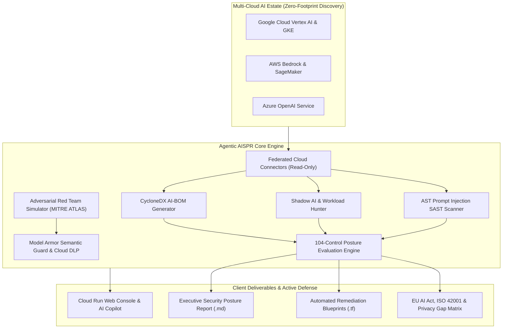

# Agentic AISPR • Enterprise AI Security Posture Review & Defense Platform

[](https://opensource.org/licenses/Apache-2.0)
[](https://www.python.org/downloads/)
[](https://cloud.google.com/run)
[](#framework-alignment)
[](https://shell.cloud.google.com/cloudshell/editor?cloudshell_git_repo=https://github.com/g-jsaccomani/aispr&cloudshell_workspace=.)
[](https://shell.cloud.google.com/cloudshell/editor?cloudshell_git_repo=https://github.com/g-jsaccomani/aispr&cloudshell_workspace=.)

**Agentic AISPR** is an autonomous, framework-agnostic **AI Security Posture Review (AI-SPM) & Active Defense Orchestrator** engineered for enterprise multi-cloud environments (Google Cloud Vertex AI, AWS Bedrock/SageMaker, Microsoft Azure OpenAI).

---

## Architecture Overview

Agentic AISPR combines zero-footprint read-only posture scanning, real-time semantic guardrails (**Google Cloud Model Armor**), continuous threat hunting (**Shadow AI Hunter & SAST**), and automated **MITRE ATLAS Red Teaming** into a unified consulting platform.



---

## Comprehensive 104-Control Security Taxonomy

The posture review evaluates enterprise AI architectures across **6 Core Domains**:

1. **Data Security & Privacy (DAT):** Grounding integrity, training data lineage, vector database isolation, Cloud KMS CMEK encryption, and automated Cloud DLP sanitization.
2. **Model Hardening & Supply Chain (MOD):** AI-BOM provenance, weights signing, Model Armor semantic floor filters, jailbreak prevention, and model inversion defenses.
3. **Application & Agentic Security (APP):** Prompt injection defense, system prompt encapsulation, tool calling boundaries, and Human-in-the-Loop approval gates.
4. **Infrastructure & Network Isolation (INF):** VPC Service Controls perimeters, Private Service Connect (PSC), elimination of public IPs on notebooks, and Shielded VMs.
5. **Security Monitoring & Threat Detection (ASR):** Security Command Center (SCC) AI Protection telemetry, prompt invocation logging, and drift alerting.
6. **AI Governance & Compliance (GOV):** ISO/IEC 42001 (AIMS) readiness, EU AI Act High-Risk system compliance, and LGPD/GDPR automated decision auditability.

---

## Quick Start & 1-Click Cloud Deployment

### 1-Click Launch in Google Cloud Shell
Click the button below to launch an interactive Cloud Shell environment with this repository automatically pre-cloned:

[](https://shell.cloud.google.com/cloudshell/editor?cloudshell_git_repo=https://github.com/g-jsaccomani/aispr&cloudshell_workspace=.)
[](https://shell.cloud.google.com/cloudshell/editor?cloudshell_git_repo=https://github.com/g-jsaccomani/aispr&cloudshell_workspace=.)

Once Cloud Shell opens, you can go from clone to a fully deployed, IAM-protected Cloud Run instance in a single guided flow:

```bash
# Option A: Interactive 1-click Client Journey (Recommended)
make journey

# Option B: Automated Serverless Build & Deploy to Google Cloud Run (IAM Protected)
gcloud builds submit --config=cloudbuild.yaml

# Option C: Automated Full 5-Phase Customer POC Pipeline
make poc
```

### 1⃣ Client Journey Modes (`make journey`):
* **`[1] Access Granted (Direct Environment Connection)`**: Direct connection to customer GCP / Multi-Cloud scope using existing credentials.
* **`[2] Generate Access Scripts (Customer-Owned Packages)`**: Generates ready-to-apply **Terraform (`.tf`)** and **Bash (`.sh`)** least-privilege auditor packages for **GCP**, **AWS**, and **Azure** under `reports/onboarding_scripts/`.
* **`[h] How-To Guide`**: Step-by-step interactive guide for executing scripts in Google Cloud Shell, AWS, and Azure.

---

## The 5-Step Guided Assessment Journey (Web Console)

Once the console launches on `http://localhost:8501`, follow the 5-step guided workflow:

1. **`1. Inventory (AI-BOM)`**: Review discovered AI models (Vertex AI, AWS Bedrock, Azure OpenAI), datasets, RAG knowledge bases, CycloneDX AI-BOM, and rogue Shadow AI containers.
2. **`2. Questionnaire`**: Evaluate the 104 AI Security Posture Review controls with real-time domain filtering and baseline gap presets.
3. **`3. Evaluation`**: Analyze the Posture Score, Domain Radar Chart, Prioritized CAPA Roadmap, and download the formal Executive Security Report (`.md`) and Terraform Blueprints (`.tf`).
4. **`4. Red Team`**: Simulate MITRE ATLAS adversarial attacks (DAN Jailbreaks, PII Exfiltration, RAG Poisoning) and test real-time Google Cloud Model Armor defense.
5. **`5. Other Clouds`**: Connect AWS and Azure environments and download provider-specific onboarding Terraform scripts.

---

## Clean Project Organization & Directory Layout

```text
aispr/
 Makefile                       # Primary entry points (make journey, make poc, make test)
 README.md                      # Primary Enterprise Documentation & Runbook
 aispr-client-journey           # 1-Click root launcher for Interactive Client Journey
 run-poc                        # 1-Click root launcher for Automated 5-Phase POC

 audit/                         # Active PHASE 1: Active GRC & 104-Control Assessment Engine
    questionnaire/             # 104-Control Taxonomy Database (Google SAIF, NIST, ISO 42001)
    engine/                    # Posture Scorer & Markdown/PDF Executive Reporter
    tests/                     # Phase 1 Unit Test Suite

 scripts/                       #  All Automation & Onboarding Scripts
    journey/                   # Interactive Client Journey Orchestrator & Cloud Shell Templates
       aispr_client_journey.py
       templates/             # GCP, AWS, Azure Terraform & Bash onboarding packages
    poc/                       # Automated 5-Phase Cloud Run & Discovery Pipeline
       01_setup_customer_environment.sh
       02_create_readonly_auditor.sh
       03_deploy_cloud_run_platform.sh
       04_execute_agentless_scans.sh
       05_generate_audit_and_reports.sh
       run_full_poc_journey.sh
       teardown_environment.sh
    cli/                       # Standalone CLI & Consulting Utilities
        aispr_cli.py
        aispr_consulting_tool.py

 docs/                          #  Enterprise Whitepapers, Architecture Blueprints & Guides
    AGENTIC_AISPR_ENTERPRISE_ARCHITECTURE.md
    HOW_TO_IMPORT_SCRIPTS.md
    aispr_agentic_architecture_blueprint.md
    aispr_custom_architecture_manifest.md

 reports/                       #  Generated Deliverables (AI-BOM, Executive Reports, IaC)
    onboarding_scripts/        # Exported ready-to-run customer auditor scripts
    aispr_consolidated_report.md
    aispr_cloud_specific_report.md
    cyclonedx_ai_bom.json
    remediations.tf

 agentic/                       #  PHASE 2 (Future Roadmap): Runtime SecOps & Threat Defense
     runtime_defense/           # Model Armor Semantic Firewall & Cloud DLP Masking
     threat_operations/         # Shadow AI Hunter, Red Team Simulator, Prompt SAST
     connectors/                # Multi-Cloud Federated Connectors (GCP, AWS, Azure)
     ui/                        # Web Console & Copilot Interface
```

---

## Web Console & Copilot Access

Once deployed via Cloud Run or locally:
* **Production Google Cloud Run URL (IAM Protected):** `https://aispr-platform-<PROJECT_NUMBER>.<REGION>.run.app`
  * Deployed with `--no-allow-unauthenticated` and restricted via `roles/run.invoker`.
  * To access the remote Cloud Run console locally with live IAM authentication tokens:
    ```bash
    gcloud run services proxy aispr-platform --region southamerica-east1 --port 8080
    ```
  * Or configure **Google Cloud Identity-Aware Proxy (IAP)** on Cloud Load Balancing (GCLB) for enterprise browser SSO.
* **Local Mirrored Console (Daemon):** `http://localhost:8501`

---

## Unit Testing & Validation

To run the complete automated test suite (62 unit tests across audit, agentic, runtime defense, and Looker BI engines):

```bash
make test
```

---

## Generated Executive Deliverables

All outputs are written to the [`reports/`](file:///Users/jsaccomani/Documents/Jetsky/My%20Projects/aispr/reports/) directory:
* **`reports/aispr_consolidated_report.md`**: Consolidated Executive Assessment Report with Topology Map, Risk Heatmaps, Prioritized CAPA Roadmaps, and Regulatory Gap Correlation (**EU AI Act**, **ISO/IEC 42001**, **LGPD**).
* **`reports/aispr_cloud_specific_report.md`**: Cloud-by-Cloud Tactical Engineering Deep Dive for GCP, AWS, and Azure.
* **`reports/aispr_looker_bigquery_schema.sql`**: BigQuery SQL DDL schema for automated Looker Studio dashboards.
* **`reports/cyclonedx_ai_bom.json`**: Standardized CycloneDX-AI Software Bill of Materials.
* **`reports/remediations.tf`**: Ready-to-apply Terraform Infrastructure as Code blueprints.
* **`reports/shadow_ai_report.json`**: Deep telemetry report on unauthorized LLM daemons and vulnerable notebooks.
* **`reports/red_team_report.json`**: MITRE ATLAS adversarial simulation results with defensive efficacy metrics.

---

## Author & License

* **Lead Architect & Consultant:** Joabson Saccomani ([@jsaccomani](https://www.linkedin.com/in/jsaccomani))
* **Role:** Cloud Security Consultant | Google Cloud
* **License:** Apache 2.0 (Copyright © 2026 Google LLC)

<!-- Checkpoint: 2026-03-06 - sec(threat-intel): update adversarial attack taxonomy for client production models -->

<!-- Checkpoint: 2026-05-25 - sec(red-teaming): incorporate automated prompt fuzzing test suite for client staging model -->
