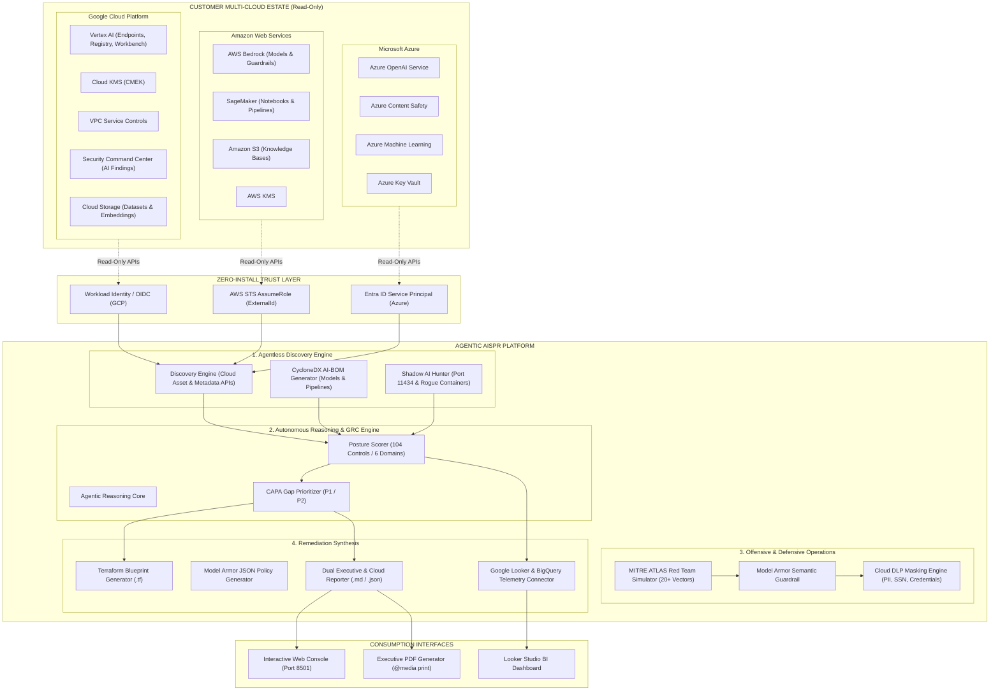
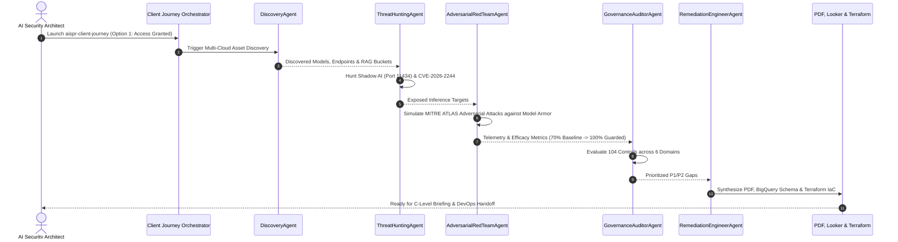

# Agentic AISPR: Enterprise Architecture & Technical Specification (Whitepaper)

**Autonomous AI Security Posture Management, Threat Operations & Runtime Defense Platform (AI-SPM & Runtime Guardrails)**

* **Author & Lead Architect:** Joabson Saccomani (@jsaccomani) — Cloud Security Consultant | Google Cloud
* **Aligned Frameworks:** Google SAIF (6 Pillars) • NIST AI RMF 1.0 • ISO/IEC 42001 (AIMS) • MITRE ATLAS • OWASP Top 10 for LLMs • SLSA for AI
* **Version:** 3.0.0 (Enterprise Multi-Cloud Edition)

---

## 1. Executive Vision & Value Proposition

**Agentic AISPR** is an autonomous enterprise platform for **AI-SPM (AI Security Posture Management)** and **Inline Runtime Defense (Semantic Firewall)** engineered to discover, audit, protect, and remediate security risks across Generative AI workloads, foundation models, fine-tuned endpoints, and multi-agent systems.

### Core Strategic Pillars for Enterprise Clients:
1. **Zero-Footprint / Agentless Discovery:** Strictly Read-Only scans via native cloud APIs without installing agents or creating invasive assets in customer environments.
2. **Multi-Cloud Native:** Unified discovery and posture assessment for **Google Cloud (Vertex AI / GKE)**, **Amazon Web Services (Bedrock / SageMaker)**, and **Microsoft Azure (Azure OpenAI / AI Search)**.
3. **Comprehensive 104-Control Taxonomy:** Granular security controls covering the full AI lifecycle (Data Security, Model Hardening, Application/Agents, Infrastructure, Telemetry, and Governance).
4. **Intelligent Auto-Population:** Ingestion of live cloud telemetry to automatically populate and evaluate up to 70% of technical security controls.
5. **Inline Defense with Google Cloud Model Armor:** Microsecond-latency semantic inspection against *Prompt Injection*, *DAN Jailbreaks*, *Toxic Content*, and automated PII masking with Cloud DLP.
6. **Customer-Owned Remediation as Code (IaC):** Automated generation of Terraform blueprints and Model Armor policies ready for immediate review and deployment by the client's DevOps/SecOps teams.

---

## 2. Enterprise System Architecture

---

## 3. Autonomous Multi-Agent Mesh Execution Flow

---

## 4. Technical Artifacts & Deliverables Summary

| Artifact Name | Purpose | Footprint | Customer Value |
| :--- | :--- | :---: | :--- |
| **`aispr-client-journey`** | Unified CLI & Onboarding Orchestrator | Zero | 1-Click interactive setup with Option 1 (Direct) & Option 2 (Script Gen) |
| **`AISPR_Consolidated_Executive_Report.md`** | C-Level Executive Assessment Deliverable | Zero | Overall score, Radar chart, EU AI Act & ISO 42001 gap correlation |
| **`AISPR_Cloud_Specific_Tactical_Report.md`** | Engineering Deep Dive | Zero | Granular tables and Terraform blueprints per cloud (GCP, AWS, Azure) |
| **`Executive Printable PDF`** | Publication-Grade Document | Zero | High-resolution printable report with corporate headers and page breaks |
| **`Looker & BigQuery Connector`** | Continuous Posture BI | Zero | BigQuery DDL schema and Looker Studio dashboard synchronization |
| **`cyclonedx_ai_bom.json`** | AI Software Bill of Materials | Zero | CycloneDX 1.6 compliance standard for ML supply chain auditing |
| **`remediations.tf`** | Remediation as Code | Zero | Customer-owned infrastructure blueprints closing identified vulnerabilities |

---

*Copyright © 2026 Google LLC. Developed by Joabson Saccomani (@jsaccomani).*
*Role: Cloud Security Consultant | LinkedIn: https://www.linkedin.com/in/jsaccomani*
*Licensed under the Apache License, Version 2.0.*

<!-- Checkpoint: 2026-03-19 - docs(delivery): finalize AI posture executive report for client security committee -->

<!-- Checkpoint: 2026-05-05 - sec(threat-intel): update adversarial attack taxonomy for client production models -->
