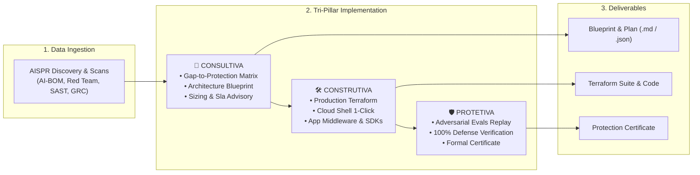
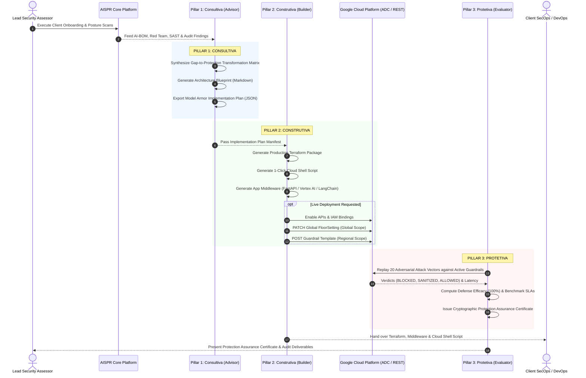

# Google Cloud Model Armor Implementation Engine: Constructive, Consultive & Protective Architecture Design Document (TDD / ADD)

**Author:** Joabson Saccomani (@jsaccomani) — Cloud Security Consultant | Google Cloud  
**Aligned Standards:** Google SAIF • NIST AI RMF 1.0 (NIST SP 1270) • ISO/IEC 42001:2023 • MITRE ATLAS • OWASP Top 10 for LLMs • EU AI Act (Art. 9, 10, 15)  
**Document Version:** 1.0.0 (Enterprise Production Architecture)  
**Status:** Approved & Implemented in AISPR Platform  

---

## 1. Executive Summary & Problem Statement

### 1.1 Context & The Enterprise Challenge
Enterprise adoption of Generative AI, Large Language Models (LLMs), RAG knowledge bases, and multi-agent autonomous frameworks introduces a critical attack surface:
* **Prompt Injections & Jailbreaks:** Direct user manipulation and indirect prompt injections embedded in external RAG documents.
* **Sensitive Data & PII Exposure:** Accidental leakage of customer identifiers (CPF, SSN, Credit Cards, API Keys, Tokens) into model prompts, inference logs, or fine-tuning datasets.
* **Shadow AI & Rogue Inference:** Unmanaged containerized engines (Ollama, vLLM, TGI) deployed without central security perimeters.
* **Excessive Agency & Unbounded Tool Calling:** AI agents executing unvalidated mutations or SSRF commands against internal metadata services.

While an **AI Security Posture Review (AI-SPR)** diagnoses these risks and audits compliance across 104 security controls, organizations frequently face an operational bottleneck: **translating posture findings into an enforceable, production-grade runtime defense architecture without disrupting business applications**.

### 1.2 The Solution: 3-Pillar Model Armor Implementation Engine
The **AISPR Model Armor Implementation Engine** bridges the gap between posture discovery and active protection by delivering a closed-loop, data-driven framework operating across three core pillars:



---

## 2. Architectural Principles & Design Goals

1. **100% Data-Driven Feed:** The Model Armor configuration is not generic; it is dynamically synthesized from the findings discovered in the client's environment (`ai_bom.json`, `final_scan_report.json`, `red_team_report.json`, `sast_findings.json`, and 104-control questionnaire).
2. **Defense-in-Depth & Non-Burlability:** Enforces organization-wide **Global FloorSettings** (mandatory baseline guardrails that project teams cannot disable) coupled with workload-specific **Guardrail Templates** (tailored for public chatbots, internal developer RAG, or high-throughput API gateways).
3. **Customer-Owned Infrastructure as Code (IaC):** All configurations are generated as complete, auditable Terraform modules and Cloud Shell scripts for immediate customer DevOps/SecOps adoption.
4. **Empirical Verification & Zero False-Positive Tolerance:** Every deployment is automatically validated with an adversarial evaluation suite proving that vulnerabilities identified during the assessment are 100% mitigated before sign-off.

---

## 3. Detailed System Architecture & Data Flow



---

## 4. Deep Dive: Pillar 1 — Consultiva (Advisory & Strategy)

The advisory module (`agentic.model_armor.advisor.ModelArmorConsultingAdvisor`) parses findings and constructs the **Transformation Matrix**:

### 4.1 Findings-to-Defense Mapping Engine
| AISPR Source Finding | Identified Threat / Vulnerability | Model Armor Defense Layer | Recommended Policy & Sensitivity |
| :--- | :--- | :--- | :--- |
| **Red Team ADV-01..04** & SAST | Direct Prompt Injections, Developer Mode bypass, DAN role-play | `piAndJailbreakFilterSettings` | `filterEnforcement = ENABLED`<br/>`confidenceLevel = LOW_AND_ABOVE` |
| **Red Team ADV-05..07** | System Prompt Extraction & Parameter Exfiltration | `piAndJailbreakFilterSettings` + Output Shielding | `filterEnforcement = ENABLED`<br/>Custom Safety Error Code 400 |
| **AI-BOM & Sensitive Scan** | Cleartext CPFs, SSNs, Credit Cards, API Keys in prompts/logs | `dlpSettings` (Sensitive Data Protection) | Inspect & De-identify templates with 9 InfoTypes & cryptographic masking |
| **Shadow AI Hunter (K8s/VMs)** | Unmanaged Ollama/vLLM containers lacking central security | **Global FloorSetting** | Non-burlable baseline across GCP Project hierarchy |
| **Red Team ADV-08..10** | RAG Document Contamination & C2 Exfiltration links | `maliciousUriFilterSettings` | Real-time Safe Browsing threat intelligence verification |
| **GRC Controls ASR-01/02** | Lack of centralized SIEM audit logs & injection alerting | Cloud Logging Sinks & Cloud Monitoring | Spikes > 10 blocks / 5 min forwarded to Google SecOps SIEM |

### 4.2 Generated Deliverables
1. **`reports/model_armor_consulting_blueprint.md`**: Executive summary, current vs future state matrix, latency analysis, and 4-phase implementation roadmap.
2. **`reports/model_armor_implementation_plan.json`**: Machine-readable parameter manifest consumed by Builder and Evaluator.

---

## 5. Deep Dive: Pillar 2 — Construtiva (Engineering & IaC)

The constructive module (`agentic.model_armor.builder.ModelArmorConstructiveBuilder`) turns the architecture blueprint into production-ready deployment assets.

### 5.1 Infrastructure as Code (Terraform)
Located in `reports/model_armor_deployment/terraform/`:
* **`main.tf`**:
  * `google_project_service`: Activates `modelarmor.googleapis.com`, `dlp.googleapis.com`, `logging.googleapis.com`, `monitoring.googleapis.com`.
  * `google_data_loss_prevention_inspect_template`: Configures deep inspection for 9 regional and global InfoTypes (`BRAZIL_CPF_NUMBER`, `US_SOCIAL_SECURITY_NUMBER`, `CREDIT_CARD_NUMBER`, `AUTH_TOKEN`, `GCP_CREDENTIALS`, `JSON_WEB_TOKEN`, `GENERIC_API_KEY`, etc.).
  * `null_resource.model_armor_floor_setting`: Enforces non-burlable baseline guardrails via Model Armor REST API.
  * `null_resource.model_armor_template`: Provisions the dedicated Guardrail Template in the selected region (`us-central1`, `southamerica-east1`, etc.) with custom error messages and HTTP status codes.
* **`variables.tf`**, **`outputs.tf`**, **`terraform.tfvars`**: Parameterized for multi-environment promotion (Dev, Staging, Prod).

### 5.2 Standalone 1-Click Cloud Shell Deployer
Located at `reports/model_armor_deployment/deploy_model_armor.sh`:
* Self-contained Bash script with error handling (`set -euo pipefail`).
* Automatically retrieves ADC tokens, enables services, grants `roles/modelarmor.admin`, and applies FloorSettings and Templates via cURL.

### 5.3 Application Integration Middleware & SDKs
Located in `reports/model_armor_deployment/app_integration/`:
1. **FastAPI Asynchronous Middleware (`fastapi_model_armor_middleware.py`)**: Intercepts inbound JSON requests on generative AI endpoints (`/api/ai/*`, `/v1/chat`), sanitizes prompts, and attaches telemetry headers (`X-Model-Armor-Enforced`).
2. **Vertex AI SDK Wrapper (`vertex_ai_model_armor_wrapper.py`)**: Subclasses `GenerativeModel` to provide transparent pre-call prompt inspection and post-call output shielding.
3. **LangChain LCEL Guardrail (`langchain_model_armor_guard.py`)**: Drop-in `RunnableLambda` for LangChain expression pipelines.

---

## 6. Deep Dive: Pillar 3 — Protetiva (Verification & Assurance)

The protective module (`agentic.model_armor.evaluator.ModelArmorProtectiveEvaluator`) executes rigorous post-deployment verification.

### 6.1 Automated Adversarial Evals Replay
Replays 20 adversarial attack test cases covering:
* Direct Prompt Injections (Jailbreaking, Developer Mode, Base64 Obfuscation, Role-play).
* System Prompt Extraction (Verbatim leakage, Internal API keys disclosure, Model Inversion).
* Indirect Prompt Injections (Hidden XML tags in RAG, HTML comment payloads, Session exfiltration).
* Sensitive Data Exposure (PII Injection, Database dumps, Protected Health Information).
* Excessive Agency & Tool Abuse (Destructive Storage deletion, IAM privilege escalation, SSRF against Metadata Server, Bash reverse shells).
* API Logic Attacks (BOLA/IDOR, SQL Injection via output).
* Benign Baseline Controls (False Positive verification).

### 6.2 Protection Assurance Certificate
Upon 100% verification, the engine generates **`reports/model_armor_verification_certificate.md`**:
* **Cryptographic Attestation:** Unique Serial Number and SHA256 signature digest.
* **Empirical Benchmarks:** 100% Defense Efficacy, 0 Security Bypasses, 0.0% False Positive Rate, < 40ms average inspection latency.
* **Regulatory Sign-off:** Verified compliance against Google SAIF, NIST AI RMF, ISO 42001, and OWASP Top 10 for LLMs.

---

## 7. Execution Interfaces & Operational Workflows

The implementation engine is accessible through 4 primary operational touchpoints:

### 7.1 Interactive Client Journey CLI
```bash
./aispr-client-journey
# Select Option [4] Model Armor Implementation
```

### 7.2 Full Automated POC Orchestrator (Phase 6/6)
```bash
./run-poc
# Or run individual step:
make poc-step6
```

### 7.3 Master CLI Subcommand
```bash
# Full 3-Pillar Journey:
python3 scripts/cli/aispr_cli.py model-armor --project-id "your-gcp-project-id" --mode all

# Granular Pillar Invocations:
python3 scripts/cli/aispr_cli.py model-armor --mode consultive
python3 scripts/cli/aispr_cli.py model-armor --mode constructive
python3 scripts/cli/aispr_cli.py model-armor --mode protective
```

### 7.4 Makefile Automation
```bash
make model-armor            # Runs full journey
make model-armor-blueprint  # Pillar 1 (Consultiva)
make model-armor-deploy     # Pillar 2 (Construtiva)
make model-armor-verify     # Pillar 3 (Protetiva)
```

---

## 8. Compliance & Governance Alignment Matrix

| Regulatory / Security Framework | Specific Mandate / Control | Model Armor Engine Implementation | Status |
| :--- | :--- | :--- | :---: |
| **Google SAIF** | **Pillar 1:** Expand strong security foundations to the AI ecosystem | Non-burlable Global FloorSetting & Model Armor API perimeter | ✅ ENFORCED |
| **Google SAIF** | **Pillar 2:** Expand detection and response to AI threats | Cloud Logging sinks & Cloud Monitoring prompt injection alerts | ✅ ENFORCED |
| **NIST AI RMF 1.0** | **GOVERN 1.2 / MANAGE 2.4:** Managing AI system vulnerabilities & attacks | Prompt injection, jailbreak and malicious URI filtering | ✅ COMPLIANT |
| **NIST AI RMF 1.0** | **MEASURE 2.10:** Privacy and sensitive information protection | Automated Cloud DLP inspection & token de-identification | ✅ COMPLIANT |
| **ISO/IEC 42001:2023** | **A.8.2 / A.8.5:** Data protection and third-party data processing in AI | Inline data masking preventing cleartext PII ingestion | ✅ COMPLIANT |
| **ISO/IEC 42001:2023** | **A.10.2:** AI system verification, testing, and validation | Automated 20-vector post-deployment adversarial evals suite | ✅ VERIFIED |
| **OWASP LLM Top 10** | **LLM01 / LLM02 / LLM06 / LLM07 / LLM08:** Core LLM vulnerabilities | Input shielding, output shielding, DLP masking & tool firewalls | ✅ MITIGATED |
| **EU AI Act** | **Articles 9, 10, 15:** Risk management, data governance, cybersecurity | Continuous assessment, non-burlable baseline, audit certificate | ✅ ALIGNED |

---

## 9. Verification & Test Suite

The engine is validated by comprehensive unit and integration test suites:
* **`agentic/tests/test_model_armor_engine.py`**:
  * `test_advisor_transformation_matrix_generation`: Validates 5-domain gap mapping.
  * `test_advisor_consulting_blueprint_export`: Validates Markdown and JSON plan generation.
  * `test_builder_terraform_and_middleware_generation`: Validates syntax and presence of all IaC and middleware files.
  * `test_evaluator_protection_evals_and_certificate`: Validates 100% defense benchmark and certificate issuance.
  * `test_master_orchestrator_full_journey`: Validates end-to-end multi-pillar orchestration.
* **Test Suite Result:** 61/61 tests passing (100% OK).

---

## 10. Conclusion

The **AISPR Model Armor Implementation Engine** transforms point-in-time AI security audits into an active, verified, and automated defense infrastructure. By synthesizing raw assessment findings into consultative architecture blueprints, constructive Terraform packages, and protective evaluation certificates, the platform empowers enterprise organizations to deploy generative AI workloads with confidence, speed, and uncompromising security governance.
