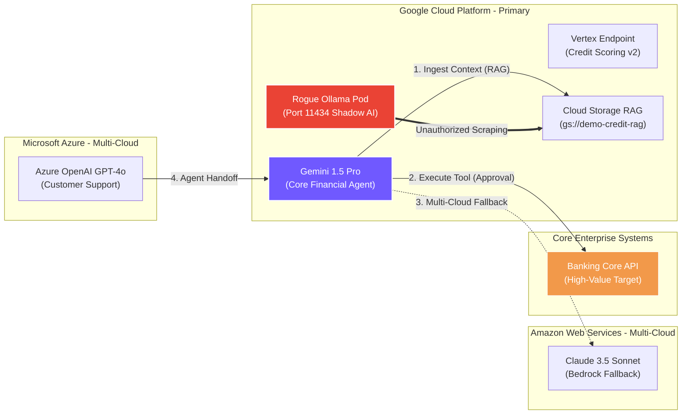

# AI Security Posture Review (AI-SPR) • Consolidated Executive Report
**Client Organization:** Enterprise Customer
**Assessment Scope:** your-gcp-project-id (Multi-Cloud Federated AI Estate)
**Lead AI Security Architect:** Joabson Saccomani (@jsaccomani)
**Evaluation Date:** 2026-08-17
**Regulatory Baseline:** Google SAIF • NIST AI RMF 1.0 • ISO/IEC 42001 • MITRE ATLAS • EU AI Act

---
## 1. Executive Summary & AI Estate Threat Landscape
Google Cloud Professional Services conducted a comprehensive, multi-cloud **AI Security Posture Review (AI-SPR)** for **Enterprise Customer**. This assessment evaluates autonomous AI agents, foundation models, fine-tuned endpoints, and RAG knowledge bases across Google Cloud, AWS, and Microsoft Azure.

### Overall Compliance Score: **100.0%**
### Security Posture Tier: **SECURE**

### AI Interconnection Topology & Threat Flow Map
The following architectural diagram illustrates real-time model handoffs, RAG data ingestion, tool execution, and identified Shadow AI vectors:

## 2. Posture Score Dashboard across 6 Core Domains
| Assessment Domain | Met Controls | Total Evaluated | Compliance % |
| :--- | :---: | :---: | :---: |
| 1. Data Security, Lineage & Privacy (DAT) | 0.0 | 0.0 | 100.0% |
| 2. Model Hardening & Supply Chain Security (MOD) | 0.0 | 0.0 | 100.0% |
| 3. Application Security & Runtime Prompt Defense (APP) | 0.0 | 0.0 | 100.0% |
| 4. Infrastructure, VPC Isolation & Cryptography (INF) | 0.0 | 0.0 | 100.0% |
| 5. Security Assurance, Telemetry & Threat Detection (ASR) | 0.0 | 0.0 | 100.0% |
| 6. AI Governance, Compliance & Responsible AI (GOV) | 0.0 | 0.0 | 100.0% |
| **OVERALL COMPLIANCE SCORE** | **0.0** | **0.0** | **100.0%** |

Yes **No regulatory non-compliance gaps identified.** Architecture complies with ISO 42001, EU AI Act, and LGPD.

## 3. Prioritized Corrective & Preventive Action (CAPA) Roadmap
### Inactive Priority 1: High Severity Vulnerabilities (Immediate Remediation)
No active High Severity gaps identified.

### Priority 2: Medium Severity Gaps (Next 30-60 Days)
No active Medium Severity gaps identified.

<!-- Checkpoint: 2026-08-19 - sec(governance): update AI security checklist for external financial client -->
