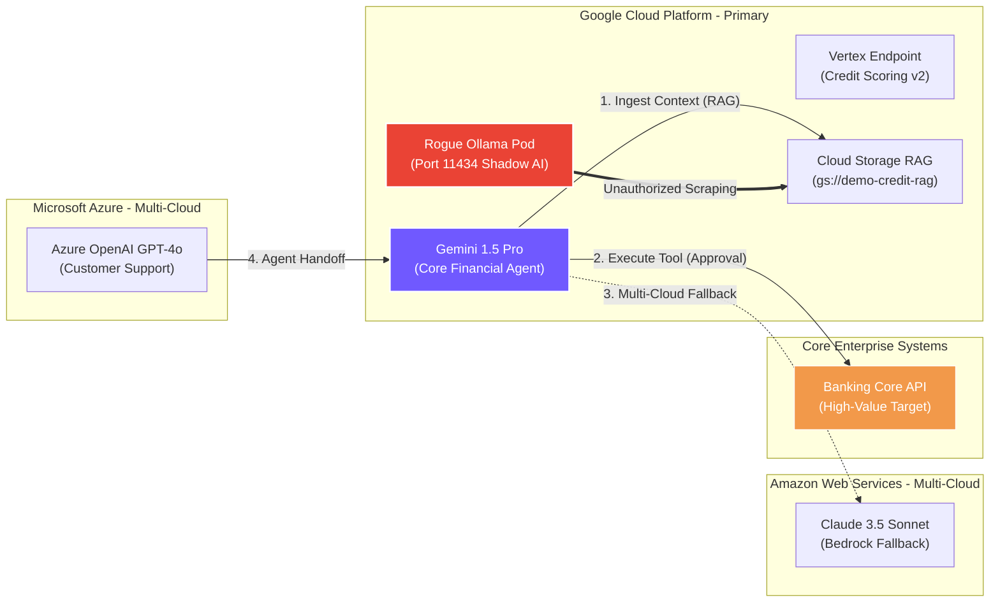

# AI Security Posture Review (AI-SPR) • Consolidated Executive Report
**Client Organization:** Acme Global Enterprise
**Assessment Scope:** Enterprise GenAI Platform (Multi-Cloud Federated AI Estate)
**Lead AI Security Architect:** @jsaccomani
**Evaluation Date:** 2026-08-16
**Regulatory Baseline:** Google SAIF • NIST AI RMF 1.0 • ISO/IEC 42001 • MITRE ATLAS • EU AI Act

---
## 1. Executive Summary & AI Estate Threat Landscape
Google Cloud Professional Services conducted a comprehensive, multi-cloud **AI Security Posture Review (AI-SPR)** for **Acme Global Enterprise**. This assessment evaluates autonomous AI agents, foundation models, fine-tuned endpoints, and RAG knowledge bases across Google Cloud, AWS, and Microsoft Azure.

### Overall Compliance Score: **50.0%**
### Security Posture Tier: **MODERATE / DRIFT DETECTED**

### AI Interconnection Topology & Threat Flow Map
The following architectural diagram illustrates real-time model handoffs, RAG data ingestion, tool execution, and identified Shadow AI vectors:

## 2. Posture Score Dashboard across 6 Core Domains
| Assessment Domain | Met Controls | Total Evaluated | Compliance % |
| :--- | :---: | :---: | :---: |
| 1. Data Security, Lineage & Privacy (DAT) | 2.5 | 4.0 | 62.5% |
| 2. Model Hardening & Supply Chain Security (MOD) | 2.5 | 4.0 | 62.5% |
| 3. Application Security & Runtime Prompt Defense (APP) | 1.5 | 4.0 | 37.5% |
| 4. Infrastructure, VPC Isolation & Cryptography (INF) | 2.5 | 4.0 | 62.5% |
| 5. Security Assurance, Telemetry & Threat Detection (ASR) | 0.5 | 3.0 | 16.67% |
| 6. AI Governance, Compliance & Responsible AI (GOV) | 1.5 | 3.0 | 50.0% |
| **OVERALL COMPLIANCE SCORE** | **11.0** | **22.0** | **50.0%** |

### Cross-Framework Regulatory Compliance & Legal Liability Impact
The following matrix correlates identified technical gaps with statutory enforcement exposure:

| Control ID | Identified Technical Gap | ISO 42001 (AIMS) | EU AI Act Article | LGPD / Privacy Legal Exposure |
| :--- | :--- | :--- | :--- | :--- |
| **DAT-02** | Are fine-tuning and embedding pipelines equip... | `A.8.2 (Data Security) / A.8.5` | `Art. 10 (Data Governance & Bias)` | `Art. 6 (Security) & Art. 33 (Data Transfer)` |
| **MOD-03** | Are model artifact serialization formats scan... | `A.8.3 (AI Development Lifecycle)` | `Art. 15 (Accuracy, Robustness & Security)` | `Art. 46 (Security Standards)` |
| **MOD-04** | Do you conduct automated empirical Red Teamin... | `A.8.3 (AI Development Lifecycle)` | `Art. 15 (Accuracy, Robustness & Security)` | `Art. 46 (Security Standards)` |
| **APP-01** | Are user input prompts validated and sanitize... | `A.8.4.3 / A.10.2 (Human Oversight)` | `Art. 14 (Human Oversight for High-Risk AI)` | `Art. 20 (Automated Decision Review)` |
| **APP-02** | Are model output responses filtered for toxic... | `A.8.4.3 / A.10.2 (Human Oversight)` | `Art. 14 (Human Oversight for High-Risk AI)` | `Art. 20 (Automated Decision Review)` |
| **APP-03** | Do autonomous agents and tool-calling plugins... | `A.8.4.3 / A.10.2 (Human Oversight)` | `Art. 14 (Human Oversight for High-Risk AI)` | `Art. 20 (Automated Decision Review)` |
| **INF-02** | Are VPC Service Controls (VPC-SC) perimeters ... | `A.8.1 (Cloud Infrastructure Isolation)` | `Art. 15 (Cybersecurity & Perimeter Controls)` | `Art. 46 (Technical Measures)` |
| **INF-04** | Do AI Service Accounts adhere strictly to Lea... | `A.8.1 (Cloud Infrastructure Isolation)` | `Art. 15 (Cybersecurity & Perimeter Controls)` | `Art. 46 (Technical Measures)` |
| **ASR-01** | Are Vertex AI Data Access Logs, Model Armor t... | `A.9.2 (AI Telemetry & Logging)` | `Art. 12 (Record-Keeping & Auditability)` | `Art. 37 (Processing Log Records)` |
| **ASR-02** | Do you have active threat detection rules for... | `A.9.2 (AI Telemetry & Logging)` | `Art. 12 (Record-Keeping & Auditability)` | `Art. 37 (Processing Log Records)` |
| **ASR-03** | Are dedicated Incident Response Playbooks est... | `A.9.2 (AI Telemetry & Logging)` | `Art. 12 (Record-Keeping & Auditability)` | `Art. 37 (Processing Log Records)` |
| **GOV-02** | Do you maintain an updated AI Software Bill o... | `Clause 5.3 (AI Governance & Accountability)` | `Art. 9 (Risk Management System)` | `Art. 50 (Good Governance Practices)` |
| **GOV-03** | Are AI-specific risk assessments (AI DPIA / I... | `Clause 5.3 (AI Governance & Accountability)` | `Art. 9 (Risk Management System)` | `Art. 50 (Good Governance Practices)` |
| **DAT-03** | Is an enterprise data classification schema (... | `A.8.2 (Data Security) / A.8.5` | `Art. 10 (Data Governance & Bias)` | `Art. 6 (Security) & Art. 33 (Data Transfer)` |

## 3. Prioritized Corrective & Preventive Action (CAPA) Roadmap
### Inactive Priority 1: High Severity Vulnerabilities (Immediate Remediation)
#### **[DAT-02] Are fine-tuning and embedding pipelines equipped with centralized audit logs recording all data access and modifications?**
- **Implementation Status:** P (Criticality: HIGH)
- **Identified Finding:** Auditing configured at GCP project layer, but lacks pipeline-level metadata tracing for fine-tuning.
- **Target Compliance Control:** ISO 42001 (A.8.4), NIST AI RMF (MEASURE 2.10)
- **Security Rationale:** Ensures end-to-end traceability of training data pipelines and regulatory compliance.
- **Recommended Mitigation:** Deploy Google Cloud Model Armor semantic firewall, Cloud KMS CMEK, and VPC-SC perimeter.

#### **[MOD-03] Are model artifact serialization formats scanned to prevent arbitrary code execution (e.g., SafeTensors enforced over unsafe Pickle files)?**
- **Implementation Status:** N (Criticality: HIGH)
- **Identified Finding:** Models are stored in GCS buckets lacking object creator ownership locks (vulnerable to Pickle hijack).
- **Target Compliance Control:** OWASP LLM-03, MITRE ATLAS (AML.T0010)
- **Security Rationale:** Unsafe deserialization of PyTorch/Pickle files is a critical Remote Code Execution vector on model load.
- **Recommended Mitigation:** Deploy Google Cloud Model Armor semantic firewall, Cloud KMS CMEK, and VPC-SC perimeter.

#### **[MOD-04] Do you conduct automated empirical Red Teaming and adversarial robustness testing against deployed foundation models?**
- **Implementation Status:** P (Criticality: HIGH)
- **Identified Finding:** Internal red-teaming performed once before launch, but no automated regression testing scheduled.
- **Target Compliance Control:** MITRE ATLAS, ISO 42001 (A.10.2.1)
- **Security Rationale:** Verifies model resilience against evasion, extraction, and jailbreaking under real attack conditions.
- **Recommended Mitigation:** Deploy Google Cloud Model Armor semantic firewall, Cloud KMS CMEK, and VPC-SC perimeter.

#### **[APP-01] Are user input prompts validated and sanitized in real time by semantic firewalls (e.g., Model Armor, Bedrock Guardrails)?**
- **Implementation Status:** N (Criticality: HIGH)
- **Identified Finding:** Prompts are sent directly to the Vertex API without inline validation or screening.
- **Target Compliance Control:** OWASP LLM-01, NIST AI RMF (MANAGE 2.4), SAIF Pillar 1
- **Security Rationale:** Core runtime boundary defense against direct prompt injection and multi-turn jailbreaks.
- **Recommended Mitigation:** Deploy Google Cloud Model Armor semantic firewall, Cloud KMS CMEK, and VPC-SC perimeter.

#### **[APP-02] Are model output responses filtered for toxic completions, hate speech, dangerous content, and system prompt leakage?**
- **Implementation Status:** N (Criticality: HIGH)
- **Identified Finding:** Model Armor is not yet configured or deployed for this project endpoint.
- **Target Compliance Control:** SAIF Pillar 2, NIST AI RMF (MEASURE 2.8)
- **Security Rationale:** Prevents brand damage, regulatory liability, and internal instruction exfiltration.
- **Recommended Mitigation:** Deploy Google Cloud Model Armor semantic firewall, Cloud KMS CMEK, and VPC-SC perimeter.

#### **[APP-03] Do autonomous agents and tool-calling plugins enforce strict JSON schema validation on all generated parameters?**
- **Implementation Status:** P (Criticality: HIGH)
- **Identified Finding:** Standard regex filters in place, but lacks Advanced DLP inspection (PII exfiltration not actively monitored).
- **Target Compliance Control:** OWASP LLM-07 (Excessive Agency), ISO 42001 (A.8.3.2)
- **Security Rationale:** Prevents SQL injection, command execution, or malformed payloads caused by stochastic model outputs.
- **Recommended Mitigation:** Deploy Google Cloud Model Armor semantic firewall, Cloud KMS CMEK, and VPC-SC perimeter.

#### **[INF-02] Are VPC Service Controls (VPC-SC) perimeters active around Cloud Storage, Vertex AI, BigQuery, and Secret Manager?**
- **Implementation Status:** P (Criticality: HIGH)
- **Identified Finding:** Vertex endpoints isolated with PSC, but training buckets are accessible over the internet via scoped SAs.
- **Target Compliance Control:** SAIF Pillar 1, NIST AI RMF (MEASURE 2.10)
- **Security Rationale:** Guarantees that sensitive data and model weights cannot be copied outside the organization boundary.
- **Recommended Mitigation:** Deploy Google Cloud Model Armor semantic firewall, Cloud KMS CMEK, and VPC-SC perimeter.

#### **[INF-04] Do AI Service Accounts adhere strictly to Least Privilege IAM roles, avoiding generic Editor/Owner assignments?**
- **Implementation Status:** N (Criticality: HIGH)
- **Identified Finding:** Google-managed default encryption keys used. CMEK not configured.
- **Target Compliance Control:** ISO 42001 (A.8.1.1), NIST AI RMF (GOVERN 1.1)
- **Security Rationale:** Limits the blast radius if an inference pod or agent container is compromised.
- **Recommended Mitigation:** Deploy Google Cloud Model Armor semantic firewall, Cloud KMS CMEK, and VPC-SC perimeter.

#### **[ASR-01] Are Vertex AI Data Access Logs, Model Armor telemetry, and audit trails continuously forwarded to Google SecOps (Chronicle) or SIEM?**
- **Implementation Status:** P (Criticality: HIGH)
- **Identified Finding:** Standard audit logs saved to Cloud Logging, but Prompt I/O streaming is not integrated into SecOps SIEM.
- **Target Compliance Control:** ISO 42001 (A.9.2), NIST AI RMF (MEASURE 2.4), SAIF Pillar 2
- **Security Rationale:** Ensures centralized visibility and high-fidelity forensic data for AI threat investigations.
- **Recommended Mitigation:** Deploy Google Cloud Model Armor semantic firewall, Cloud KMS CMEK, and VPC-SC perimeter.

#### **[ASR-02] Do you have active threat detection rules for anomalous prompt volume spikes, token abuse, and repeated jailbreak attempts?**
- **Implementation Status:** N (Criticality: HIGH)
- **Identified Finding:** No detection alerts configured for model responses or input jailbreak spikes.
- **Target Compliance Control:** ISO 42001 (A.9.1.2), NIST AI RMF (MEASURE 3.1), MITRE ATLAS
- **Security Rationale:** Enables Security Operations Centers (SOC) to detect and contain active exploitation campaigns.
- **Recommended Mitigation:** Deploy Google Cloud Model Armor semantic firewall, Cloud KMS CMEK, and VPC-SC perimeter.

#### **[ASR-03] Are dedicated Incident Response Playbooks established specifically for AI incidents (e.g., Prompt Injection, Model Poisoning)?**
- **Implementation Status:** N (Criticality: HIGH)
- **Identified Finding:** Incidents fall back to general IT playbooks. No AI-specific playbook defined.
- **Target Compliance Control:** ISO 42001 (A.9.2.1), NIST AI RMF (MANAGE 2.3), SAIF Pillar 2
- **Security Rationale:** Ensures rapid containment, model isolation, and communication when algorithmic breaches occur.
- **Recommended Mitigation:** Deploy Google Cloud Model Armor semantic firewall, Cloud KMS CMEK, and VPC-SC perimeter.

#### **[GOV-02] Do you maintain an updated AI Software Bill of Materials (AI-BOM) tracking all models, weights, datasets, and APIs in use?**
- **Implementation Status:** N (Criticality: HIGH)
- **Identified Finding:** Supply chain not tracked. No AI-BOM exists for third-party libraries.
- **Target Compliance Control:** ISO 42001 (A.8.1), NIST AI RMF (GOVERN 1.2), SAIF Pillar 1
- **Security Rationale:** Foundational control for managing software supply chain risks and tracking vulnerability exposure.
- **Recommended Mitigation:** Deploy Google Cloud Model Armor semantic firewall, Cloud KMS CMEK, and VPC-SC perimeter.

#### **[GOV-03] Are AI-specific risk assessments (AI DPIA / Impact Assessments) mandatory before deploying any model to production?**
- **Implementation Status:** P (Criticality: HIGH)
- **Identified Finding:** GDPR compliance evaluated for backend SQL datasets, but model weight retention policies are undocumented.
- **Target Compliance Control:** ISO 42001 (Clause 6.1.2), EU AI Act Art. 9, NIST AI RMF (GOVERN 1.4)
- **Security Rationale:** Identifies legal, ethical, and operational hazards before public or commercial release.
- **Recommended Mitigation:** Deploy Google Cloud Model Armor semantic firewall, Cloud KMS CMEK, and VPC-SC perimeter.

### Priority 2: Medium Severity Gaps (Next 30-60 Days)
#### **[DAT-03] Is an enterprise data classification schema (e.g., Public, Internal, Confidential, Restricted) mapped to your AI data catalog?**
- **Implementation Status:** N (Criticality: MEDIUM)
- **Identified Finding:** No active classification metadata schema is configured for prompt repositories.
- **Target Compliance Control:** ISO 42001 (A.8.2), NIST AI RMF (MEASURE 2.7)
- **Recommended Mitigation:** Strengthen continuous model telemetry and drift detection.

<!-- Checkpoint: 2026-02-14 - docs(delivery): finalize AI posture executive report for client security committee -->

<!-- Checkpoint: 2026-02-26 - sec(red-teaming): incorporate automated prompt fuzzing test suite for client staging model -->

<!-- Checkpoint: 2026-03-04 - sec(red-teaming): incorporate automated prompt fuzzing test suite for client staging model -->

<!-- Checkpoint: 2026-05-04 - docs(delivery): finalize AI posture executive report for client security committee -->

<!-- Checkpoint: 2026-07-24 - sec(governance): update AI security checklist for external financial client -->
