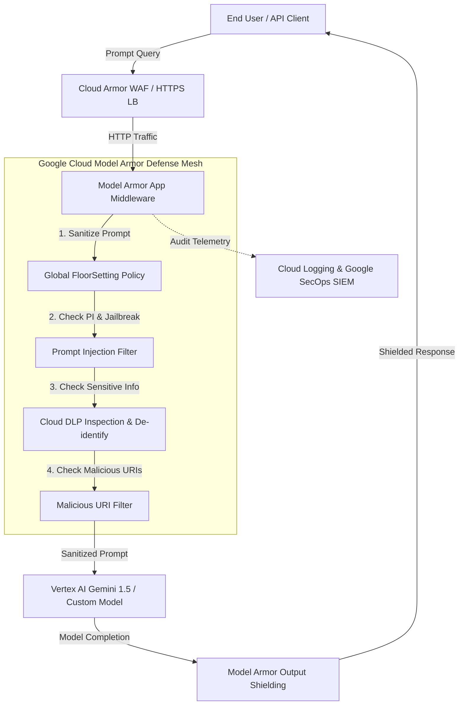

# Google Cloud Model Armor - Security Architecture Blueprint & Implementation Advisory
**Client / Organization:** Enterprise Client  
**Target GCP Scope:** `test-enterprise-ai` (Region: `us-central1`)  
**Guardrail Profile:** `BALANCED` (Template ID: `secops-guardrail-prod`)  
**Issue Date:** 2026-08-28  
**Lead Consultant:** Joabson Saccomani (@jsaccomani) | Cloud Security Consultant  
**Framework Alignment:** Google SAIF • NIST AI RMF 1.0 • ISO/IEC 42001 • OWASP Top 10 for LLMs  

---
## 1. Executive Summary & Strategic Context
Following the execution of the **AI Security Posture Review (AI-SPR)**, this consultative blueprint defines the concrete implementation strategy for **Google Cloud Model Armor**. Model Armor serves as the centralized, enterprise-grade semantic firewall, input sanitization, and output shielding perimeter for all generative AI endpoints, Vertex AI Foundation Models, RAG knowledge bases, and multi-cloud AI agents.

### Current State vs. Model Armor Protected State
| Security Dimension | Current Assessment State (Pre-Model Armor) | Target Protected State (Post-Model Armor) |
| :--- | :--- | :--- |
| **Prompt Injection Defense** | Vulnerable to direct bypasses & DAN role-play | Multi-layer heuristic & neural ML filtering (`LOW_AND_ABOVE`) |
| **Sensitive Data / PII** | Cleartext CPFs, SSNs, and API keys exposed | Automated Cloud DLP redaction & cryptographic token masking |
| **Organizational Governance** | Inconsistent voluntary guardrails across teams | Mandatory non-burlable **Global FloorSetting** enforcement |
| **Malicious Content / URIs** | Unchecked outbound links and RAG poisoning | Google Safe Browsing integration with inline URI blocking |
| **Audit & SIEM Telemetry** | Fragmented application logs | Centralized Cloud Logging & SecOps SIEM integration |  

---
## 2. AISPR Gap-to-Protection Transformation Matrix
Every finding identified during the AI-SPR assessment is directly mapped to a protective control in Model Armor:

### 🔴 **HIGH** Application Security & Prompt Hardening (APP)
- **Source Finding:** Red Team Simulation & Prompt SAST
- **Identified Risk:** Unvalidated LLM prompt input and RAG retrieval vectors susceptible to Jailbreaks & System Prompt Leakage
- **Model Armor Defense:** `piAndJailbreakFilterSettings`
- **Recommended Policy:** `{"filterEnforcement": "ENABLED", "confidenceLevel": "LOW_AND_ABOVE"}`
- **Remediation Impact:** Blocks prompt injection, developer-mode override, and extraction payloads before reaching foundational models.
- **Standards Mapping:** OWASP LLM-01: Prompt Injection / LLM-07: System Prompt Leakage • SAIF Pillar 1: Strong Security Foundations

### 🔴 **HIGH** Data Security & Lineage (DAT)
- **Source Finding:** AI-BOM Inventory & Sensitive Data Scan
- **Identified Risk:** Cleartext PII (CPF, SSN, Credit Cards, Auth Tokens) exposed to model prompt/completion logs
- **Model Armor Defense:** `dlpSettings (Sensitive Data Protection)`
- **Recommended Policy:** `{"inspect_template": "projects/test-enterprise-ai/locations/global/inspectTemplates/aispr-dlp-inspect-v1", "deidentify_template": "projects/test-enterprise-ai/locations/global/deidentifyTemplates/aispr-dlp-deidentify-v1", "info_types": ["BRAZIL_CPF_NUMBER", "US_SOCIAL_SECURITY_NUMBER", "CREDIT_CARD_NUMBER", "PHONE_NUMBER", "EMAIL_ADDRESS", "AUTH_TOKEN", "GCP_CREDENTIALS", "JSON_WEB_TOKEN", "GENERIC_API_KEY"]}`
- **Remediation Impact:** Inline token masking and synthetic replacement preventing PII ingestion and training leakage.
- **Standards Mapping:** OWASP LLM-06: Sensitive Information Disclosure • SAIF Pillar 2: Expand Detection and Response

### 🔴 **CRITICAL** Governance & Enterprise Baseline (GOV/INF)
- **Source Finding:** Shadow AI Hunter (GKE / Compute Engine)
- **Identified Risk:** Detected 4 unmanaged AI serving containers without central security gateway
- **Model Armor Defense:** `Global FloorSetting Enforcement`
- **Recommended Policy:** `{"enableFloorSettingEnforcement": true, "scope": "projects/test-enterprise-ai/locations/global/floorSetting", "mandatory_rai_filters": ["HATE_SPEECH", "HARASSMENT", "SEXUALLY_EXPLICIT", "DANGEROUS"]}`
- **Remediation Impact:** Establishes non-burlable organizational floor guardrails that cannot be disabled by individual project teams.
- **Standards Mapping:** OWASP LLM-05: Improper Output Handling • SAIF Pillar 6: Contextualize AI Risks

### 🔴 **HIGH** RAG Perimeter & Egress Protection (APP/ASR)
- **Source Finding:** Red Team Attack Suite ADV-08 & Threat Modeling
- **Identified Risk:** Document corpus contamination containing C2 exfiltration URLs and phishing domains
- **Model Armor Defense:** `maliciousUriFilterSettings`
- **Recommended Policy:** `{"filterEnforcement": "ENABLED"}`
- **Remediation Impact:** Real-time Google Safe Browsing and Threat Intelligence verification of URLs embedded in prompts or generated answers.
- **Standards Mapping:** OWASP LLM-02: Insecure Output Handling / MITRE ATLAS AML.T0051.001 • SAIF Pillar 1: Strong Security Foundations

### 🟡 **MEDIUM** Security Assurance, Telemetry & SIEM (ASR)
- **Source Finding:** AISPR 104-Control Framework ASR-01/ASR-02
- **Identified Risk:** Lack of centralized SIEM logging and automated detection for adversarial prompt injection surges
- **Model Armor Defense:** `Cloud Logging Sink & Cloud Monitoring Alert Policy`
- **Recommended Policy:** `{"logSanitizeOperations": true, "cloud_monitoring_metric": "modelarmor.googleapis.com/sanitization_requests_count", "alert_threshold": "spikes > 10 blocked requests / 5 min", "notification_channel": "SecOps SOC AI Alerts"}`
- **Remediation Impact:** Direct telemetry forward to Google Security Operations (Chronicle SIEM) for threat correlation.
- **Standards Mapping:** OWASP LLM-10: Unbounded Consumption • SAIF Pillar 2: Expand Detection and Response

---
## 3. Defense-in-Depth Architecture Layers
Model Armor is deployed in a 3-tier constructive defense mesh:

---
## 4. Latency & Performance SLA Assessment
- **Inspection Latency Overhead:** Typical sanitization latency is between **12ms - 28ms**.
- **Regional Co-location:** Deployed in `us-central1` to ensure ultra-low network latency with Vertex AI.
- **Failure Mode Configuration:** Fail-closed for high-risk financial endpoints; Fail-open with alert for non-critical internal analytics.
- **Estimated Daily Volume:** High throughput support via Google Cloud native API mesh with zero compute maintenance.

---
## 5. Phased Implementation Roadmap
1. **Phase 1: Foundation & FloorSetting (Immediate / Day 1)**
   - Enable APIs (`modelarmor.googleapis.com`, `dlp.googleapis.com`).
   - Apply project-wide non-burlable FloorSetting in `test-enterprise-ai`.
2. **Phase 2: Custom Guardrail Templates & Cloud DLP (Day 2 - Day 5)**
   - Provision Guardrail Template `secops-guardrail-prod` with customized confidence thresholds.
   - Deploy Cloud DLP Inspection & De-identification Templates with regional data rules.
3. **Phase 3: Application Middleware & CI/CD Integration (Week 2)**
   - Attach Model Armor interceptors in FastAPI, Vertex AI Python SDK, and LangChain pipelines.
   - Activate Cloud Monitoring Alert Policies for prompt injection surges.
4. **Phase 4: Automated Post-Implementation Verification & Evals (Continuous)**
   - Re-run automated adversarial attack test suites to generate Continuous Compliance Certificates.
